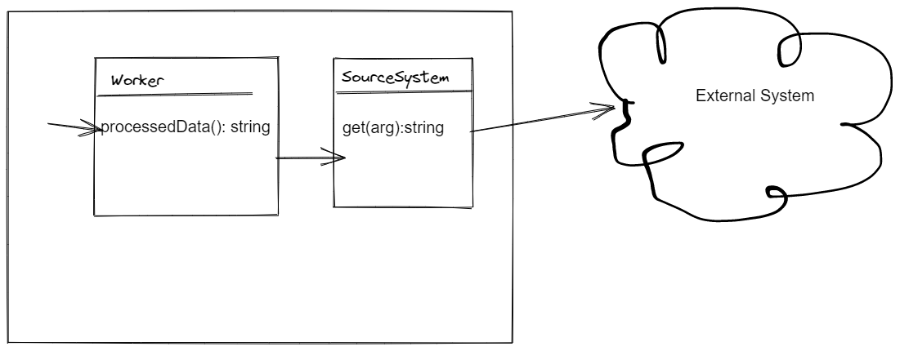
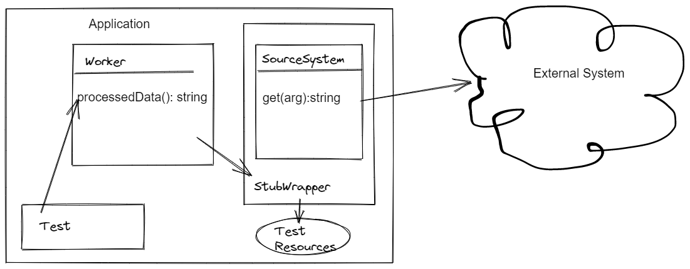

# anystub-core   

[](https://sonarcloud.io/summary/new_code?id=anystub_anystub-core)
[](https://maven-badges.herokuapp.com/maven-central/org.anystub/anystub-core)

The library helps you automatically record and maintain request/response stubs in java tests - what you are missing when use [Wiremock](https://wiremock.org/). Inspired by vcr in RoR.

Install from Maven Central 
===

``` xml
    <dependency>
      <groupId>org.anystub</groupId>
      <artifactId>anystub</artifactId>
      <version>0.9.0</version>
      <scope>test</scope>
    </dependency>
```


Example
===

In the example we build 2 layers application. Layer 1 extracts data from an external system, Layer 2 process the response to produce
some business valuable result.



We want to write a test for Worker::processedData method. This is not a demo for mockito or wiremock, hence you will not see it here.
With anystub-core you can create a wrapper for SourceSystem class which intercepts get-calls. In the first ever call the
wrapper allows to hit the real external system and records response. In the next run of the test the wrapper will reproduce
the response without calling a real system. Here what you create in your test. 



[Full example and more](https://github.com/anystub/anystub-examples/tree/main/plain2/src/main/java/org/anystub/examples) 


``` java
public class SourceSystemImpl implements SourceSystem {
    @Override
    public String get(String arg) throws IOException {
        .....
        // hit external system
    }
}
```

You have class Worker which uses SourceSystem to get data from external data source.

``` java 
 public class Worker {

    private final SourceSystem sourceSystem;

    public Worker(SourceSystem sourceSystem) {
        this.sourceSystem = sourceSystem;
    }

    public String processedData() throws IOException {
        // work out business valuable result
    }

}
```

Manual creating of a wrapper for any kind of class is a very unified process. Stub class should have a link to a real
object to SourceSystem and every method is a call of Base:requestX function with the same arguments. 

``` java
public class StubSourceSystem implements SourceSystem {

    final private SourceSystem realSourceSystem;

    public StubSourceSystem(SourceSystem realSourceSystem) {
        this.realSourceSystem = realSourceSystem;
    }

    @Override
    public String get(String arg) throws IOException {
        return BaseManagerFactory
                .locate()
                .request(() -> realSourceSystem.get(arg),
                        arg);
    }
}

```

Higher level libraries implement the wrappers for httpClient, JdbcTemplate, RestClient, WebClient, OpenApi generated SDK. 
So you do not need to repeat it and create stubs on low level. 

The test should include re-creating test application and the actual call:

```
class WorkerTest {

    Worker worker;

    @BeforeEach
    void setup() {
        SourceSystem sourceSystem = new SourceSystemImpl();
        SourceSystem stubSourceSystem = new StubSourceSystem(sourceSystem);
        worker = new Worker(stubSourceSystem);
    }

    @Test
    @AnyStubId
    void testWorker() throws IOException {
        String s = worker.processedData();
        assertTrue(s.contains("Winning isn't everything"));

    }
}
```
After running the test you can find a newly created file at src/test/resources/anystub/testWorker.yml. The name is taken 
from the name of annotated test method.

```
exception: []
keys: worker's arg
values: '..."Winning isn''t everything.. It''s the"...'
```

- The wrapper allows to record responses from a real system.
- First run of the test verifies the full chain
- Test work against permanent real data which is not changing over time
- If a test makes multiple calls all the responses go to a single stub-file
- To update stubs (when a spec of the external system changed) you remove files and restart tests. New stub will be recorded
- You can manage stubs with the `@AnystubId` annotation - record only new requests, record all requests, create fake responses, 
prohibit not recorded calls and etc


## Stub naming 

Anystub automatically creates stub-files where names build from class and method names annotated with `@AnyStubId`

Here is the specification
- test class annotated, filename not specified
  - test methods not annotated or annotated without filename -> stub-name "className-methodName.yml"
  - test method annotated and file name specified as "filename2" -> stub-name "filename2.yml"  
- test class annotated, filename specified as "filename1"
  - test methods not annotated or annotated without filename -> stub-name "filename1-methodName.yml"
  - test method annotated and file name specified as "filename2" -> stub-name "filename2.yml"
- test class not annotated
  - test methods not annotated -> stub-name is not defined. requests fallback at test/resources/anystub/stub.yml
  - annotated without filename -> stub-name "className-methodName.yml"
  - test method annotated and file name specified as "filename2" -> stub-name "filename2.yml"

## Configuration files

You can change some aspects with configuration files. configuration files are located in "resources/anystub/" and starts from a dot.
By default, tests load configuration from "resources/anystub/.config.yml". 
These are available settings:

- allHeaders: true/false - setting to include all headers into request key
- headers: string or array - headers which need to include into request key
- bodyMethods: POST, PUT, DELETE - list of HTTP-verbs, which include body into request key 
- bodyTrigger: string or array - if any string is found in URL request body is included into key  
- requestMask: "password: .{2,10}\\," - all subsequences in request body that match replace to ellipsis     


Following reading:
- Apache HttpClient, RestTemplate, JdbcTemplate, OpenApi (anystub)[https://github.com/anystub/anystub]
- WebClient (anystub-reactive)[https://github.com/anystub/anystub-reactive]
- Examples how to use anystub with spring-boot (anystub-examples)[https://github.com/anystub/anystub-examples]
